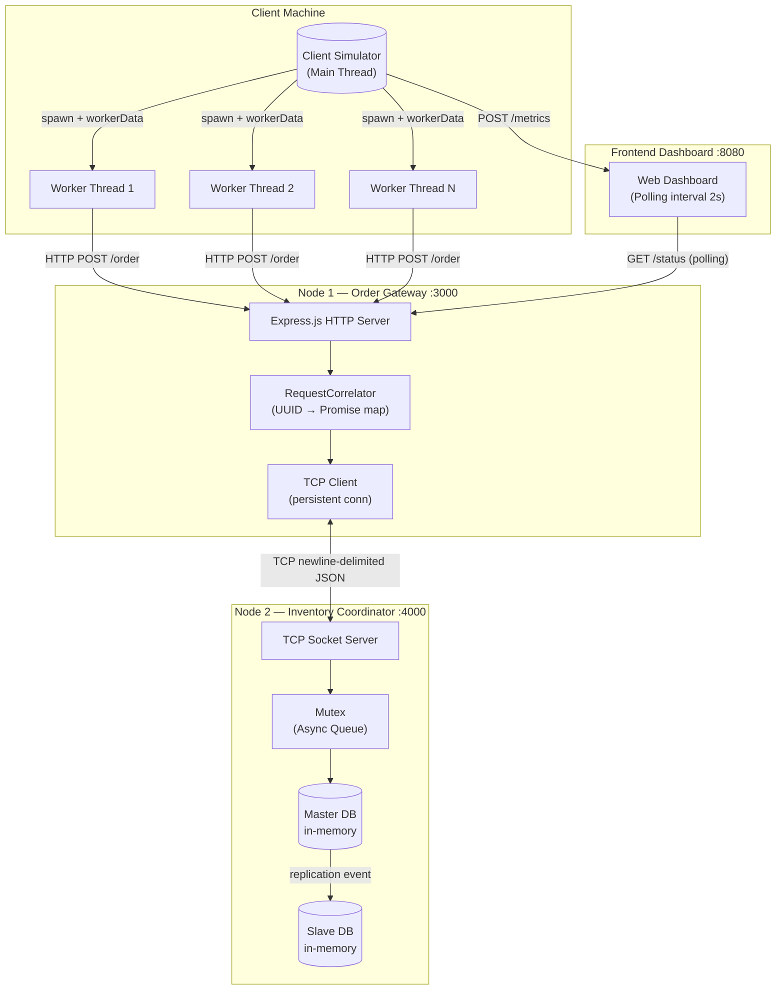

# Design Document — Flash Sale E-Commerce Simulator

## Overview

Flash Sale E-Commerce Simulator adalah sistem terdistribusi yang membuktikan konsep *parallel computing* dan *distributed systems* dalam konteks flash sale. Sistem terdiri dari empat komponen yang saling berkomunikasi untuk mensimulasikan 5.000 permintaan pembelian serentak, mencegah *race condition* dengan mekanisme mutex, dan mengukur metrik performa.

**Tujuan utama desain:**
- Memisahkan tanggung jawab antar komponen secara jelas (Separation of Concerns)
- Mengimplementasikan komunikasi antar-node yang efisien dan tahan terhadap kegagalan
- Menjamin kebenaran operasi stok (tidak ada *overselling*) di bawah beban konkuren tinggi
- Menyediakan observabilitas real-time melalui dashboard web

**Stack teknologi:**
- **Node.js** — runtime utama semua komponen
- **Express.js** — HTTP server pada Order Gateway
- **`worker_threads`** — modul paralel Node.js untuk Client Simulator
- **`net`** — modul TCP Socket bawaan Node.js untuk komunikasi antar-node
- **HTML/CSS/JavaScript** — Frontend Dashboard

---

## Architecture

### Diagram Arsitektur Sistem



### Alur Pemrosesan Satu Permintaan

```mermaid
sequenceDiagram
    participant WT as Worker Thread
    participant OG as Order Gateway
    participant RC as RequestCorrelator
    participant IC as Inventory Coordinator
    participant MX as Mutex
    participant MDB as Master DB
    participant SDB as Slave DB

    WT->>+OG: HTTP POST /order { productId, quantity }
    OG->>OG: Validasi payload
    OG->>OG: Generate requestId (UUID)
    OG->>RC: register(requestId) → Promise
    OG->>+IC: TCP → { requestId, productId, quantity, type:"order" }\n
    IC->>MX: enqueue(requestId)
    MX->>+MDB: Acquire → Read stock
    MDB-->>MX: currentStock = N
    alt stock >= quantity
        MX->>MDB: Write stock = N - quantity
        MDB-->>IC: ok, remainingStock
        IC->>SDB: applyReplication(productId, remainingStock, now())
        IC-->>-OG: TCP ← { requestId, status:"success", remainingStock }\n
    else stock < quantity
        IC-->>-OG: TCP ← { requestId, status:"failed", reason:"insufficient_stock" }\n
    end
    MX->>MX: Release → next in queue
    OG->>RC: resolve(requestId, tcpResponse)
    OG-->>-WT: HTTP 200 { status, remainingStock }
```

### Protokol Komunikasi

| Jalur | Protokol | Format | Port Default |
|-------|----------|--------|--------------|
| Worker Thread → Order Gateway | HTTP/1.1 POST | JSON body | 3000 |
| Order Gateway → Inventory Coordinator | TCP (persistent) | Newline-delimited JSON | 4000 |
| Dashboard → Order Gateway | HTTP GET polling | JSON response | 3000 |
| Client Simulator → Dashboard | HTTP POST | JSON body | 8080 |

---

## Components and Interfaces

### 1. Client Simulator (`simulator/`)

Komponen ini bertanggung jawab membangkitkan beban (*load generation*) dan mengukur performa sistem.

#### Struktur Folder dan File

```
simulator/
├── index.js                  # Entry point — baca config, pilih mode, jalankan runner
├── config.js                 # Default config: gatewayUrl, workerCount, totalRequests, mode
├── runner/
│   ├── sequentialRunner.js   # Eksekusi permintaan satu per satu secara berurutan
│   └── parallelRunner.js     # Spawn worker_threads & koordinasi hasil
├── worker/
│   └── requestWorker.js      # Script yang dijalankan oleh setiap Worker Thread
├── metrics/
│   ├── metricsCollector.js   # Kumpulkan & hitung: executionTime, throughput, speedup
│   └── metricsReporter.js    # Cetak ke konsol & simpan ke file JSON
└── results/                  # Output folder untuk file laporan JSON
```

#### Interface Class Utama

```javascript
// parallelRunner.js
class ParallelRunner {
  constructor(config)              // { gatewayUrl, workerCount, totalRequests, timeoutMs }
  async run()                      // return MetricsResult
}

// sequentialRunner.js
class SequentialRunner {
  constructor(config)
  async run()                      // return MetricsResult
}

// metricsCollector.js
class MetricsCollector {
  start()                          // catat startTime = performance.now()
  recordSuccess(responseTimeMs)    // increment successCount
  recordFailure(reason)            // increment failCount
  finalize()                       // return MetricsResult
}

// metricsReporter.js
class MetricsReporter {
  printSummary(result)             // cetak ke konsol (console.table)
  async saveToFile(result)         // simpan ke results/metrics-{timestamp}.json
  async sendToDashboard(result, dashboardUrl)  // HTTP POST ke dashboard
}
```

#### Worker Thread Communication Protocol

```javascript
// Main thread → Worker Thread: via workerData (immutable)
const workerData = {
  gatewayUrl: "http://localhost:3000/order",
  requests: [{ productId: "FLASH-ITEM-001", quantity: 1 }],  // slice per worker
  timeoutMs: 10000
}

// Worker Thread → Main thread: via parentPort.postMessage()
{ type: "result", requestId, status: "success" | "failed", responseTimeMs, statusCode }
{ type: "done", successCount, failCount }
```

---

### 2. Order Gateway (`gateway/`)

Komponen ini berfungsi sebagai gerbang HTTP yang menerima, memvalidasi, dan meneruskan permintaan ke Inventory Coordinator melalui koneksi TCP persisten.

#### Struktur Folder dan File

```
gateway/
├── index.js                  # Entry point — init Express server & TCP client
├── config.js                 # HTTP port, TCP host/port, retry settings
├── routes/
│   └── orderRoutes.js        # Route: POST /order, GET /status
├── middleware/
│   └── validatePayload.js    # Validasi field productId (string) & quantity (int > 0)
├── tcp/
│   ├── tcpClient.js          # Manajemen koneksi TCP persisten + auto-reconnect
│   └── requestCorrelator.js  # Map requestId → { resolve, reject, timeout }
└── utils/
    └── logger.js             # Structured logging: [TIMESTAMP][LEVEL][COMPONENT] msg
```

#### Interface Class Utama

```javascript
// tcpClient.js
class TcpClient {
  constructor(host, port, options)    // options: { maxRetries: 5, retryIntervalMs: 1000 }
  async connect()
  async send(messageObj)              // serialize + '\n', return Promise<responseObj>
  isConnected()                       // return boolean
  onDisconnect(callback)
  destroy()
}

// requestCorrelator.js
class RequestCorrelator {
  register(requestId, timeoutMs)      // return Promise<tcpResponse>
  resolve(requestId, data)            // dipanggil saat TCP data untuk requestId diterima
  getPendingCount()                   // return integer — untuk monitoring
}
```

#### Route Contract

```
POST /order
  Body:     { productId: string, quantity: integer }
  200 OK:   { requestId, status: "success"|"failed", remainingStock, reason? }
  400:      { error: "Field 'productId' harus berupa string non-kosong" }
  503:      { error: "Inventory service unavailable" }

GET /status
  200 OK:   { masterStock, slaveStock, slaveLastUpdated, replicationLag, isSynced }
```

---

### 3. Inventory Coordinator (`inventory/`)

Komponen inti yang mengelola stok dengan mutex async dan mensimulasikan replikasi Master-Slave DB.

#### Struktur Folder dan File

```
inventory/
├── index.js                  # Entry point — init TCP server, inject dependencies
├── config.js                 # TCP port, initialStock, mutexTimeoutMs
├── server/
│   └── tcpServer.js          # TCP Server: terima koneksi, buffer stream, route message
├── core/
│   ├── mutex.js              # Mutex berbasis Promise chain (async queue)
│   ├── inventoryService.js   # Logika bisnis: processOrder, getStatus, reset
│   └── replicationManager.js # Koordinasi replikasi Master → Slave
├── db/
│   ├── masterDB.js           # MasterDB — write dengan mutex + event emitter
│   └── slaveDB.js            # SlaveDB — hanya menerima applyReplication()
└── utils/
    └── logger.js             # Structured logging dengan timestamp
```

#### Interface Class Utama — Mutex

Implementasi mutex menggunakan pola *async queue* yang memanfaatkan sifat single-threaded Node.js:

```javascript
// mutex.js
class Mutex {
  constructor(timeoutMs = 5000)
  
  /**
   * Akuisisi mutex. Jika sudah terkunci, masuk antrian dan tunggu.
   * @returns {Function} release — panggil untuk melepas lock
   */
  async acquire()
  
  isLocked()        // return boolean
  queueLength()     // return integer — jumlah yang menunggu
}

// Pola penggunaan (async queue):
// const release = await mutex.acquire();
// try {
//   // critical section — aman dari concurrent access
// } finally {
//   release();  // selalu lepaskan di finally
// }
```

#### Interface Class Utama — Database

```javascript
// masterDB.js
class MasterDB {
  constructor(initialStock)        // initialStock: Map<productId, integer> atau number
  getStock(productId)              // return integer (read-only, tanpa mutex)
  async decrementStock(productId, quantity)  // return { success, remainingStock }
  reset(productId, stock)          // reset ke nilai awal
  onWrite(listener)                // EventEmitter: emit setiap write berhasil
}

// slaveDB.js
class SlaveDB {
  applyReplication(productId, stock, timestamp)   // satu-satunya cara update data
  getStock(productId)              // return integer
  getLastUpdated(productId)        // return Date
  getReplicationLag()              // return milidetik sejak update terakhir
}

// inventoryService.js
class InventoryService {
  constructor(masterDB, slaveDB, mutex)
  async processOrder(productId, quantity, requestId)  // return InventoryResult
  async getStatus()   // return { masterStock, slaveStock, slaveLastUpdated, isSynced }
  async reset(productId)
}
```

---

### 4. Frontend Dashboard (`dashboard/`)

Aplikasi web satu halaman untuk visualisasi metrik performa dan status replikasi database secara real-time.

#### Struktur Folder dan File

```
dashboard/
├── index.html                # Halaman utama — layout dashboard
├── server.js                 # HTTP server: sajikan static files + API endpoints
├── css/
│   └── style.css             # Styling: grid layout, warna indikator sync/out-of-sync
└── js/
    ├── app.js                # Entry point JS — init polling, bind event handlers
    ├── charts.js             # Bar chart perbandingan Execution Time (Chart.js)
    ├── stockDisplay.js       # Komponen stok Master vs Slave + indikator divergence
    └── metricsPanel.js       # Panel Execution Time, Throughput, Speedup
```

#### Dashboard Server API

```
GET  /              → Sajikan index.html
GET  /api/metrics   → Return MetricsResult terkini dari memory
POST /api/metrics   → Terima dan simpan MetricsResult dari Client Simulator
GET  /api/status    → Proxy GET /status dari Order Gateway (atau cache 2 detik)
GET  /health        → { status: "ok", uptime }
```

---

## Data Models

### OrderPayload — HTTP Request Body

```javascript
{
  "productId": "FLASH-ITEM-001",  // string, wajib, non-kosong
  "quantity": 3                   // integer, wajib, rentang 1–100
}
```

### TcpMessage — Gateway ke Inventory (newline-terminated)

Setiap pesan adalah satu baris JSON diakhiri `\n`. Tipe pesan yang didukung:

| `type` | Deskripsi | Field wajib |
|--------|-----------|-------------|
| `order` | Permintaan pengurangan stok | `requestId`, `productId`, `quantity` |
| `status` | Permintaan baca status stok | `requestId` |
| `reset` | Reset stok ke nilai awal | `requestId`, `productId` |
| `init` | Inisialisasi stok sesi baru | `requestId`, `productId`, `initialStock` |

```javascript
// Contoh pesan order:
{"requestId":"550e8400-e29b-41d4-a716-446655440000","productId":"FLASH-ITEM-001","quantity":3,"type":"order"}\n
```

### TcpResponse — Inventory ke Gateway (newline-terminated)

```javascript
// Sukses:
{"requestId":"550e8400-...","status":"success","remainingStock":997}\n

// Gagal — stok tidak cukup:
{"requestId":"550e8400-...","status":"failed","reason":"insufficient_stock","remainingStock":0}\n

// Error — JSON tidak valid:
{"requestId":null,"status":"error","reason":"invalid_json"}\n
```

### MetricsResult — Output Client Simulator

```javascript
{
  "sessionId": "uuid-v4",
  "mode": "parallel",           // "sequential" | "parallel"
  "workerCount": 50,
  "totalRequests": 5000,
  "successCount": 1000,
  "failCount": 4000,
  "executionTimeMs": 3500,
  "throughputRps": 285.71,
  "speedup": 4.2,               // null jika baru satu mode; number jika keduanya ada
  "timestamp": "2025-01-15T10:30:00.000Z"
}
```

### DBState — In-Memory Database

```javascript
// MasterDB internal state
{
  products: Map<productId, { stock: number, version: number }>,
  writeLog: Array<{ productId, delta, remainingStock, timestamp, requestId }>
}

// SlaveDB internal state
{
  products: Map<productId, { stock: number, lastUpdated: Date }>,
}
```

### StatusResponse — GET /status

```javascript
{
  "masterStock": 750,
  "slaveStock": 750,
  "slaveLastUpdated": "2025-01-15T10:30:01.234Z",
  "replicationLag": 12,
  "isSynced": true,
  "mutexQueueLength": 0
}
```

---

## Correctness Properties

*A property is a characteristic or behavior that should hold true across all valid executions of a system — essentially, a formal statement about what the system should do. Properties serve as the bridge between human-readable specifications and machine-verifiable correctness guarantees.*

Fitur ini **layak** untuk property-based testing karena mengandung logika bisnis kritis (operasi stok, validasi payload, parsing TCP) yang harus berlaku untuk semua kemungkinan input dan urutan eksekusi.

---

### Property 1: Stok Tidak Pernah Negatif (Anti-Overselling)

*For any* nilai stok awal dan *for any* jumlah N permintaan pengurangan stok yang datang secara serentak (termasuk kasus di mana total `quantity` melebihi stok awal), nilai stok pada Master DB setelah semua operasi selesai tidak boleh pernah kurang dari nol.

**Validates: Requirements 3.4, 3.5, 3.6, 3.7, 3.9**

---

### Property 2: Konservasi Stok (Stock Conservation Invariant)

*For any* sesi simulasi dengan stok awal `initialStock`, jumlah unit yang berhasil terjual adalah `sum(successfulOrders[i].quantity)`. Maka: `masterDB.getStock() + sum(successfulOrders[i].quantity) = initialStock`. Tidak ada stok yang "hilang" atau "tercipta" di luar operasi yang sah.

**Validates: Requirements 3.6, 3.7, 3.9**

---

### Property 3: Konvergensi Replikasi Slave ke Master

*For any* operasi tulis yang berhasil pada Master DB, setelah jeda waktu tidak lebih dari 100 milidetik, nilai `slaveDB.getStock(productId)` harus sama persis dengan `masterDB.getStock(productId)`.

**Validates: Requirements 4.1, 4.2, 4.4**

---

### Property 4: Korelasi Request-Response TCP Tidak Silang

*For any* batch pesan TCP yang dikirimkan secara serentak dari Order Gateway ke Inventory Coordinator, masing-masing dengan `requestId` unik (UUID), setiap respons yang diterima harus mengandung `requestId` yang identik dengan permintaan asalnya — tidak ada permintaan yang mendapat respons milik permintaan lain.

**Validates: Requirements 8.5**

---

### Property 5: Validasi Payload Komprehensif

*For any* HTTP request body yang diterima Order Gateway: (a) jika `productId` kosong atau tidak bertipe string, MAKA response adalah HTTP 400 dan tidak ada pesan yang diteruskan ke TCP; (b) jika `quantity` ≤ 0 atau bukan integer, MAKA response adalah HTTP 400; (c) jika kedua field valid, MAKA pesan diteruskan ke Inventory Coordinator dan tidak dikembalikan HTTP 400.

**Validates: Requirements 2.2, 2.3, 2.4**

---

### Property 6: Round-Trip Parsing Pesan TCP

*For any* objek JSON yang valid, melakukan serialize ke string JSON lalu menambahkan karakter newline (`\n`), kemudian mem-*parse* string tersebut (termasuk skenario di mana pesan tiba dalam beberapa fragmen TCP yang digabungkan), menghasilkan objek yang secara struktural identik dengan objek aslinya.

**Validates: Requirements 8.1, 8.2, 8.3, 8.4**

---

### Property 7: Kebenaran Kalkulasi Metrik Performa

*For any* pasangan `(startTime, endTime)` di mana `endTime > startTime`, dan *for any* pasangan `(successCount, failCount)` di mana keduanya ≥ 0: `executionTimeMs = endTime - startTime`, `throughputRps = successCount / (executionTimeMs / 1000)`, `successCount + failCount = totalRequests`, dan `speedup = tSequential / tParallel` (jika kedua nilai tersedia dan `tParallel > 0`).

**Validates: Requirements 5.1, 5.2, 5.3, 5.5**

---

### Property 8: Keunggulan Waktu Eksekusi Parallel vs Sequential

*For any* sesi simulasi 5.000 permintaan yang dijalankan dalam kondisi sistem yang sama, dengan `workerCount` ≥ 2, Execution Time mode Parallel harus lebih kecil dari Execution Time mode Sequential, sehingga nilai Speedup `S = T_sequential / T_parallel` selalu lebih besar dari 1.

**Validates: Requirements 5.2, 1.4, 1.5**

---

## Error Handling

### Order Gateway — Strategi Penanganan Error

| Kondisi | Penanganan | Kode HTTP |
|---------|------------|-----------|
| `productId` kosong / bukan string | Return 400 + pesan field tidak valid | 400 |
| `quantity` ≤ 0 atau bukan integer | Return 400 + pesan deskriptif | 400 |
| Koneksi TCP ke Inventory gagal | Retry otomatis 5x interval 1 detik | — |
| TCP gagal setelah 5 retry | Return 503 kepada client | 503 |
| TCP response timeout (> 10 detik) | Reject promise correlator, return 503 | 503 |
| Unhandled exception di Express | Log terstruktur ke konsol, proses tetap hidup | 500 |

### Inventory Coordinator — Strategi Penanganan Error

| Kondisi | Penanganan |
|---------|------------|
| Pesan TCP bukan JSON valid | Kirim `{ status: "error", reason: "invalid_json" }`, server tidak crash |
| Stok tidak mencukupi | Kirim `{ status: "failed", reason: "insufficient_stock" }`, mutex dilepas |
| Mutex tidak dilepas dalam 5 detik | Force-release mutex, log `[CRITICAL] Mutex force-released` |
| Koneksi TCP dari Gateway terputus | Bersihkan pending requests koneksi itu, layani koneksi lain tetap jalan |
| Unhandled exception | Log terstruktur, proses tetap hidup (gunakan `process.on('uncaughtException')`) |

### Client Simulator — Strategi Penanganan Error

| Kondisi | Penanganan |
|---------|------------|
| Worker Thread tidak respons ≥ 10 detik | Catat sebagai gagal, Worker Thread lain tetap berjalan |
| Respons HTTP non-200 | Catat sebagai gagal dengan kode status |
| Koneksi ditolak (ECONNREFUSED) | Catat sebagai gagal dengan `reason: "connection_refused"` |
| Mode tidak valid | Cetak error + nilai valid, `process.exit(1)` tanpa kirim request |

### Format Log Terstruktur (Semua Komponen)

```
[ISO_TIMESTAMP] [LEVEL] [COMPONENT] MESSAGE {context_json}
```

Contoh:
```
[2025-01-15T10:30:01.234Z] [INFO]     [INVENTORY] Order processed { requestId:"abc-123", result:"success", remaining:997 }
[2025-01-15T10:30:01.235Z] [WARN]     [INVENTORY] Mutex force-released after 5000ms { requestId:"def-456" }
[2025-01-15T10:30:01.240Z] [ERROR]    [GATEWAY]   TCP connection lost, retrying 1/5
[2025-01-15T10:30:01.300Z] [INFO]     [SIMULATOR] Session complete { mode:"parallel", execTime:3500, rps:285.7 }
```

---

## Testing Strategy

### Penilaian Kelayakan Property-Based Testing

Fitur ini **layak** untuk PBT karena:
- Terdapat fungsi murni dengan perilaku input/output jelas: operasi stok, validasi payload, kalkulasi metrik, parsing pesan TCP
- Terdapat *universal invariants* kritis yang harus berlaku di semua input: stok tidak negatif, konservasi stok, korelasi UUID
- Input space besar: kombinasi productId, quantity, urutan arrival, ukuran fragmen TCP, nilai metrik
- Logika mutex dan pengurangan stok adalah bisnis inti yang harus diverifikasi dengan cakupan luas

**Library PBT:** `fast-check` (JavaScript/Node.js)
```bash
npm install --save-dev fast-check
```

**Library Test Runner:** `jest` (unit + integration tests)
```bash
npm install --save-dev jest
```

### Pendekatan Pengujian Ganda

**Property-Based Tests** (`fast-check`, minimal 100 iterasi per property):
- Untuk setiap property dari Correctness Properties section
- Tag: `// Feature: flash-sale-simulator, Property N: <deskripsi property>`
- Konfigurasi:
  ```javascript
  import fc from 'fast-check';
  fc.configureGlobal({ numRuns: 100, verbose: true });
  ```

**Unit Tests** (`jest`):
- Kasus konkret, edge case, dan error conditions
- Fokus pada integrasi komponen (mock TCP)

### Pemetaan Property ke Test Implementation

| # | Property | File Test | Pendekatan |
|---|----------|-----------|------------|
| 1 | Stok Tidak Negatif | `inventory/core/__tests__/stockSafety.test.js` | PBT: generate N serentak requests, async Promise.all, assert stock >= 0 |
| 2 | Konservasi Stok | `inventory/core/__tests__/stockConservation.test.js` | PBT: generate (initial, requests), assert sold + remaining = initial |
| 3 | Konvergensi Replikasi | `inventory/db/__tests__/replication.test.js` | PBT: generate write ops, `await sleep(100)`, assert slave = master |
| 4 | Korelasi Request-Response | `gateway/tcp/__tests__/correlation.test.js` | PBT: generate batch UUID messages, assert response.requestId = sent.requestId |
| 5 | Validasi Payload | `gateway/middleware/__tests__/validate.test.js` | PBT: generate valid & invalid payloads, assert HTTP status correct |
| 6 | Round-Trip Parsing TCP | `inventory/server/__tests__/tcpParser.test.js` | PBT: generate JSON objects, split random chunks, assert parse = original |
| 7 | Kalkulasi Metrik | `simulator/metrics/__tests__/calculations.test.js` | PBT: generate (start, end, success, fail), assert formulas benar |
| 8 | Parallel < Sequential | `simulator/__tests__/performance.test.js` | Integration test: jalankan kedua mode, assert tParallel < tSequential |

### Unit Test Cases Penting

```javascript
// masterDB.test.js
describe('MasterDB', () => {
  test('stok tidak turun di bawah 0 untuk quantity melebihi stok')
  test('pengurangan berhasil saat quantity tepat = currentStock')
  test('reset mengembalikan stok ke nilai initialStock')
  test('concurrent decrementStock tidak menghasilkan nilai negatif')
})

// mutex.test.js
describe('Mutex', () => {
  test('hanya satu operasi berjalan dalam satu waktu (serial execution)')
  test('operasi yang antri diproses FIFO')
  test('force-release terjadi setelah mutexTimeoutMs terlewati')
  test('release di finally mencegah deadlock')
})

// validatePayload.test.js
describe('validatePayload middleware', () => {
  test('menolak payload tanpa field productId')
  test('menolak payload dengan productId string kosong ("")')
  test('menolak payload dengan quantity = 0')
  test('menolak payload dengan quantity negatif')
  test('menolak payload dengan quantity bukan integer (float: 1.5)')
  test('menerima payload valid: productId non-kosong, quantity = 1')
  test('menerima payload valid: quantity = 100 (batas atas)')
})
```

### Integration Test Cases

```javascript
describe('Flash Sale End-to-End', () => {
  test('5000 permintaan serentak tidak menyebabkan overselling (stock >= 0)')
  test('gateway melakukan reconnect ke inventory setelah koneksi TCP terputus')
  test('TCP message fragmentation ditangani dengan benar di inventory')
  test('reset endpoint mengembalikan stok tanpa perlu restart layanan')
})
```
